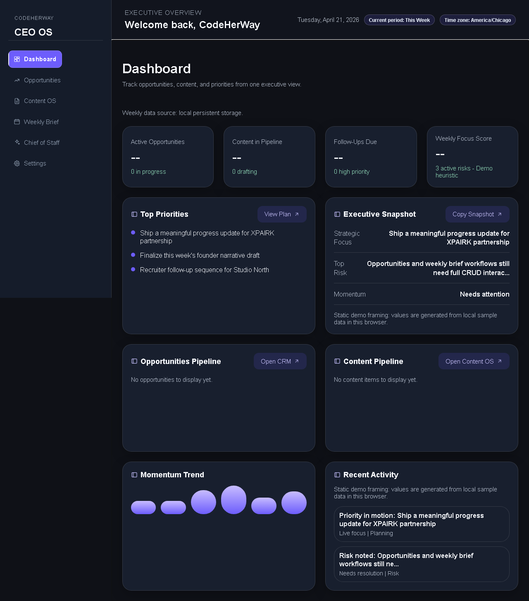
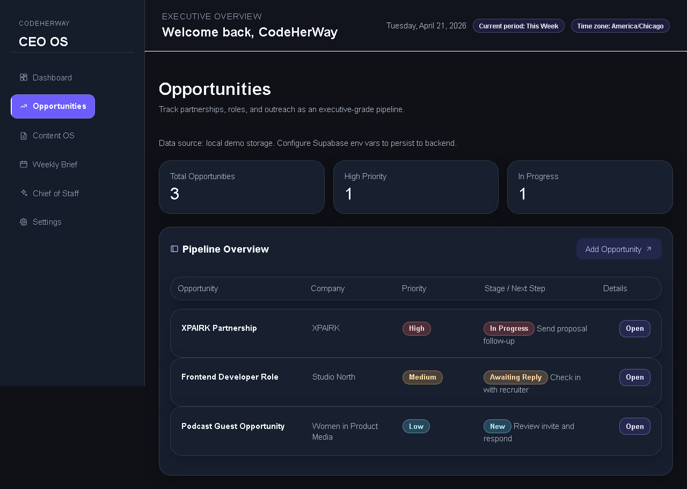
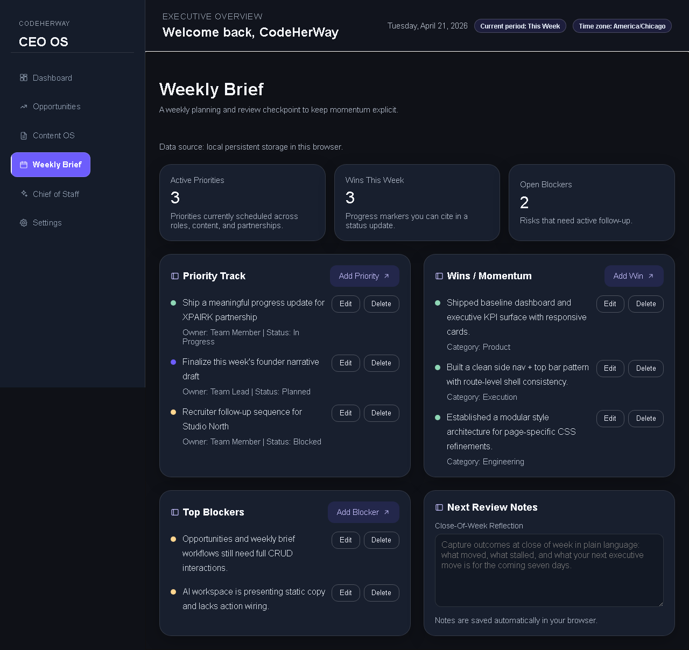
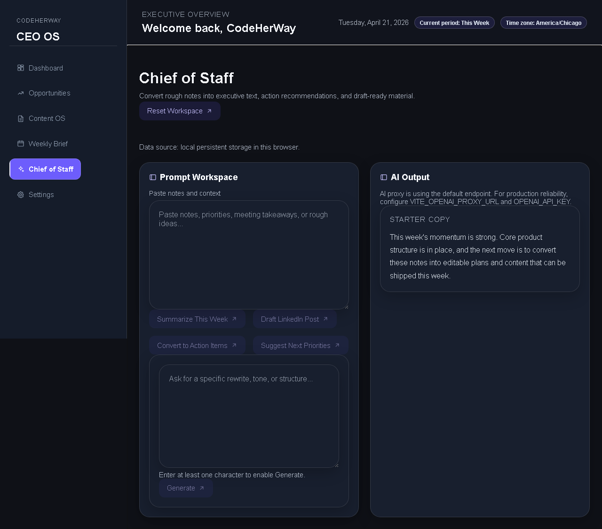
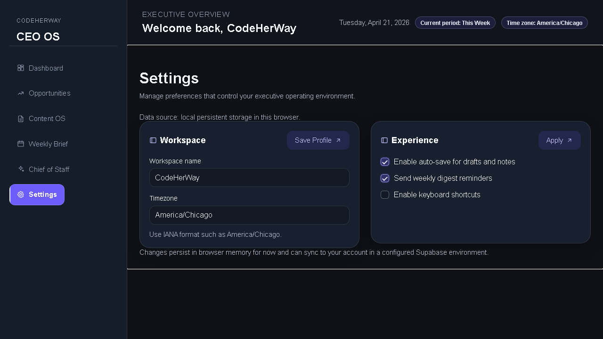

# CodeHerWay CEO OS

CodeHerWay CEO OS is a React + Vite blueprint-style command center for founder-facing workflows:

- Focus Home command center with ADHD-supportive states and reset flow
- Sticky-note Capture workspace for fast brain-dump input
- Private Journal prompts with local daily autosave
- Deterministic reminders + suggestion layer (no AI required)
- Opportunities, Content OS, Weekly Brief, and Chief of Staff workflows
- Shared System Pulse that keeps Focus, Momentum, Blockers, Ideas, and Reset connected

The project is intentionally local-first by default with a first-class Supabase path for authenticated, account-scoped persistence.

## Quickstart for reviewers

Use this path if you are opening the repo for the first time and want proof quickly:

```bash
npm install
npm run dev
```

Then open `http://127.0.0.1:5173/` and run:

```bash
npm run lint
npm run test:run
npm run build
```

## Launch the site

Use these exact commands:

```bash
npm install
npm run dev
```

Open `http://127.0.0.1:5173/` in your browser.

## 5-minute product walkthrough

Use this exact flow for portfolio demos or recruiter screenshares:

1. Focus Home: show support mode chips, next-move CTA, reminders, suggestions, and overwhelmed reset.
2. Capture: add one sticky note as `idea`, then edit text/category inline.
3. Journal: answer one prompt and show immediate autosave status.
4. Weekly Brief + Opportunities: add one blocker or in-progress item and return to Focus Home.
5. Chief of Staff: paste notes, reload once to show local persistence, then generate output and accept at least one structured recommendation.

## Recruiter summary

CodeHerWay CEO OS is best framed as a product-minded frontend systems project: a calm founder command center with local-first resilience, a Supabase upgrade path, explicit failure handling, and end-to-end verification for the workflows reviewers can actually click through.

## Portfolio review snapshot

This project is strongest when presented as a local-first productivity system with a real backend upgrade path, not as a finished SaaS. The current implementation now covers the core reviewer risks:

- Direct Netlify routes are protected with an SPA fallback and E2E direct-route refresh tests.
- Persisted state key swaps and malformed CRUD repository responses now recover cleanly instead of silently reusing stale values or showing false empty states.
- Route labels, navigation, and metadata come from one route definition source to reduce product drift.
- App routing now derives route paths from the same route metadata used by navigation and page descriptions.
- Route error recovery returns users directly to Focus Home instead of relying on fragile browser history.
- Sidebar branding and topbar timezone metadata now consume the same workspace-settings pathway as the Settings page, with browser coverage for the save-to-shell flow.
- CRUD mutation flows guard in-flight saves, deletes, and pending confirmations so rapid clicks or route changes do not create duplicate writes or late state updates.
- Settings saves now guard duplicate submits, reject failed local persistence explicitly, and expose busy/invalid states through accessible button names.
- Chief workspace and Weekly Brief local persistence now fail explicitly when browser storage rejects writes, so the UI does not imply unsaved work was safely stored.
- Weekly Brief rejects stale item update/delete attempts without emitting fake progress events.
- Weekly Brief recovery now reloads persisted data after save failures so optimistic edits do not linger as false truth in the interface.
- Capture rejects stale sticky-note edits/deletes without fake update events.
- Opportunities and Content OS reject stale local edits/deletes without writing unchanged data or emitting fake update events.
- Capture and Journal autosave copy now changes to a paused state when local saves fail.
- Chief of Staff fallback output is visibly labeled when AI is unavailable, with error metadata preserved for trust/debugging.
- Chief workspace notes now persist across reloads, reset cleanly, and are covered by Playwright so the workflow behaves like a real saved workspace instead of a one-tab demo.
- Reminder completion is timestamped, summarized, and reversible so Focus Home shows real execution progress without trapping accidental checks.
- Source-status recovery cues now explain when the app is showing a cached workspace snapshot while sync reconnects.
- Async hydration guards are strict-mode-safe, which keeps local dev, Playwright, and production behavior aligned for reviewer demos.
- System Pulse and Chief telemetry refreshes ignore stale async results, reducing noisy state updates during Strict Mode, fast navigation, and reviewer reloads.
- Dashboard next-move selection is validated against the current queue so stale recommendations do not stay pinned after the underlying work changes.
- Focus Home decision rules now live in tested product logic, including blocked-work context, pending reminders, and journal heaviness without a next action.
- Focus Home support modes now use keyboard-friendly roving focus, with E2E coverage for mode switching and reminder completion.
- Compact mobile navigation now closes cleanly after clicks, programmatic route changes, and browser-history returns, with unit and Playwright coverage.
- Focus Home capture, journal, and reminder signal loading is centralized in a dedicated hook so the command center stays composition-first.
- Next-move guidance now prioritizes the oldest unfinished reminder, reducing the risk that quiet commitments get buried.
- Focus Home loading and reminder-helper states now expose busy/status/description semantics without making the interface visually louder.
- Focus Home and Weekly Brief now refresh from storage, focus, and visibility changes so the command center is less likely to show stale context after tab switches.
- Capture empty-submit feedback is connected directly to the note field, and the Capture workspace has reload-persistence E2E coverage.
- App-shell crash recovery is covered globally, so sidebar/topbar/shell failures are caught instead of blanking the whole app.
- Source and System Pulse cues now expose accessible status/labels while staying visually quiet on mobile screens.
- Chief telemetry diagnostics are split from the initial route bundle so observability detail stays available without bloating the first Chief of Staff load.
- CI covers lint, build, typecheck, unit tests, route performance budgets, and Playwright smoke flows.

### Honest current boundaries

- Authentication and multi-user account UX are not yet a complete product experience.
- Supabase persistence exists as an upgrade path, but several local-first workflows still need end-to-end authenticated UX review.
- Chief of Staff is useful as a structured assistant workflow, but production AI readiness still depends on deployed secrets, proxy auth, observability, and usage controls.
- Screenshots and demo recordings should be refreshed after major UI changes before this is used as a flagship portfolio artifact.
- See [docs/KNOWN_LIMITATIONS.md](./docs/KNOWN_LIMITATIONS.md) for the current recruiter-facing limitation list.

## Recent calm-OS audit improvements

Driven by a structured product + UX audit of the system, this branch adds:

- **Honest sync status** — a `SyncStatusPill` in the topbar combines `useWorkspaceSettings().source` with `useOnlineStatus()` and renders one of three states: **Synced**, **Local only**, or **Offline** (with a calm pulse animation that respects `prefers-reduced-motion`). Users never silently fall off Supabase, and they always know when the network is gone.
- **Corruption recovery, not silent loss** — `usePersistentState` now preserves any unreadable JSON blob under a `${key}__corrupt_<ts>` backup key and emits a `ceo-os:storage-corruption` event. A non-blocking `StorageCorruptionBanner` tells the user we kept a copy.
- **Optimistic locking for local CRUD** — local Opportunities, Content OS, and Weekly Brief items now stamp `updatedAt` on writes and reject stale saves with a `StaleRecordError` (encoded once in a shared `assertRecordIsFresh` helper). `useCrudPage` surfaces this as a friendly form error: *"This record was changed in another window."* — and refreshes the list under the open modal so closing it reveals the up-to-date row instead of hiding the conflict.
- **Cross-page promotion** — three verbs share a single `usePromotionAction` hook (per-record in-flight guard, id-membership check, async run, toast feedback): each Capture sticky has "Make reminder" and "Track opportunity" actions, and each pending Focus Home reminder has a "Promote" action that creates a weekly priority. All three use the existing repositories, fire calm toast confirmations, and leave the source record in place so the user decides whether to keep the long-form context.
- **Accessibility automation** — `@axe-core/playwright` scans every primary route with the wcag2a/wcag2aa/best-practice rule set; serious/critical violations fail CI, and lighter findings are reported for review.
- **Debounced reflective autosave** — the Weekly Brief close-of-week reflection now debounces to 600ms and surfaces an explicit `Saving / Saved / Couldn't save` indicator next to the field; errors are routed through toasts and `appErrorTelemetry`.
- **Tonal scope** — `SystemPulse` is hidden on Settings and Ops Reliability so action-mode copy doesn't pull at users who are in setup or diagnostic contexts.
- **Grouped IA** — the sidebar now groups routes into **Today / This week / Workspace / Account**. Account links (Ops Reliability, Settings) are visually demoted so daily surfaces lead the eye.
- **Light theme** — a `:root[data-theme="light"]` overlay in `tokens.css` and a `useThemePreference` hook expose a System / Dark / Light picker in Settings. The preference is stored locally so no Supabase profile-schema migration is required, and OS preference changes are reactive when "System" is selected.
- **Architecture cleanup** — `Dashboard.jsx` is split into `FocusModeChips` and `RemindersPanel` (491 → 379 lines); the `.crm-table` primitives are extracted into a shared `crm-table.css` consumed by Opportunities and Content OS; the sync-pill descriptor is a pure helper at `src/lib/syncStatusDescriptors.js`.
- **Settings autosave on blur** — input fields and toggles persist immediately while the explicit `Save Settings` button is preserved as a "save now" affordance.
- **Motion token system** — `--duration-fast / --duration-base / --duration-deliberate` and `--easing-standard` are exported from `tokens.css` so transitions can converge on a calm rhythm.

Coverage for the above ships in this branch: 389 unit/integration tests, lint, typecheck, build, and route-budget checks all pass. The `@axe-core/playwright` sweep ships as a Playwright spec — exercise it on a machine with browsers installed (`npx playwright install` first).

## What this repository demonstrates

### 1) Architecture consistency

- Route files are intentionally thin and composition-first.
- Data orchestration and side effects live in `src/hooks`.
- Repository modules under `src/lib` own normalization, persistence, and transport concerns.
- The app shell owns shared structure and meta behaviors, not domain logic.
- CRUD domain pages now use a slot-based template contract (`header`, `status`, `summary`, `section`, `modals`) instead of a flat prop list, which keeps page scaffolding maintainable as features grow.

### 2) Repository pattern across domains

Implemented across:

- `src/lib/opportunitiesRepository.js`
- `src/lib/contentRepository.js`
- `src/lib/weeklyRepository.js`
- `src/lib/settingsRepository.js`
- `src/lib/chiefRepository.js`
- `src/lib/captureRepository.js`
- `src/lib/journalRepository.js`
- `src/lib/remindersRepository.js`

Each repository follows the same contract:

- Normalize and default incoming data
- Read/write from the active source (`local` vs `supabase`)  
- Emit domain events after changes for lightweight synchronization
- Keep consumers independent of storage transport details

The deterministic recommendation layer is handled by `src/lib/suggestions.js`, and shared cross-route pulse orchestration is handled by `src/hooks/useSystemPulse.js`.
Focus Home next-action ranking is handled by `src/lib/focusHomeLogic.js` so decision-support behavior can evolve without bloating the route page.
Focus Home supporting signals are handled by `src/hooks/useFocusHomeSignals.js`, keeping capture, journal, and reminder subscriptions out of route composition.

### 3) Reliable local-first + optional cloud workflows

- Without environment credentials, the app works from browser storage.
- With credentials + session, repositories upgrade to Supabase-backed persistence.
- Source state is surfaced as `local` or `supabase` so behavior stays transparent to users.

### 4) AI proxy integration with safe failure behavior

- Client requests are routed through a server endpoint:
  - `VITE_OPENAI_PROXY_URL` in frontend config (defaults to `/api/chief-of-staff`)
  - `api/chief-of-staff.js` (Vercel-style)
  - `netlify/functions/chief-of-staff.js` (Netlify)
- `src/lib/openai.js` handles:
  - request timeout/abort behavior
  - normalized parsing across tool-like outputs and plain text responses
  - structured payload extraction with deduplication
  - graceful fallback output when proxy/parse fails

### 5) Accessibility and UX polish

- Skip link and focus restoration in shell
- Single semantic page landmarks and route heading structure
- Clear loading, empty, and fallback states
- Source/status messaging for persistence mode
- Accessible source-status and System Pulse labels for trust cues that assistive technology can read
- Controlled keyboard interactions and form behavior in core workflows
- Compact mobile navigation closes predictably across route clicks and history navigation.
- Focus Home loading and reminder-helper states include status and described-by semantics for assistive technology.
- Interactive data rows in opportunities/content tables support keyboard activation (`Enter` / `Space`) in addition to pointer interaction.
- Settings validation announces invalid timezone feedback once, keeps the save action disabled with a descriptive name, and exposes save progress through form busy state.
- Weekly Brief pauses its autosave confidence copy when a save/load error is active instead of over-promising persistence.
- Capture and Journal use the same autosave health copy pattern, so failure states do not keep reassuring users incorrectly.
- Opportunity and Content stale-record errors tell users to refresh and retry when a record changed elsewhere.

### 6) Test and quality culture

- Hook tests cover orchestration and synchronization.
- Library tests cover parsing, settings normalization, and metadata helper behavior.
- Route tests cover key visibility and accessibility flows.
- Playwright covers direct-route refreshes, CRUD smoke paths, Focus Home execution, and Chief workspace persistence/reset behavior.
- Playwright also covers compact mobile navigation behavior so portfolio demos do not depend on untested responsive shell assumptions.
- Playwright now also covers saving workspace settings and seeing shell branding/timezone update across routed navigation.

## Project layout

```text
src/
  components/      # Reusable UI primitives and domain components
  hooks/           # Workflow orchestration and state composition
  layouts/         # Shell behavior and route frame
  lib/             # Repositories, integration, and utilities
  pages/           # Route-level composition
  styles/          # Shared styles and page-specific styling
```

## Development

```bash
npm install
npm run dev
```

### Quality checks

```bash
npm run lint
npm run build
npm run test:run
npm run test:integration:telemetry
npm run typecheck
npm run test:e2e
npm run check:route-budgets
npm run check:route-budgets:trend
npm run report:route-budgets
npx markdownlint-cli2 "**/*.md" "!node_modules/**"
npm run check:telemetry-ingest:health
npm run check:telemetry-ingest:slo
npm run build:slo-trend-snapshot
npm run persist:slo-trend-snapshot
npm run transition:ops-incident-state
```

### Route baseline governance

- Route performance baseline is tracked in `scripts/route-performance-baseline.json`.
- Baseline refresh is release-governed:
  - run workflow **Release Route Baseline Refresh** on `release` publish or manual dispatch
  - workflow executes `npm run update:route-budgets:baseline:release` with release approval env
- PR CI enforces static budgets + trend regression checks, and publishes `route-size-report` artifact.
- When `SUPABASE_TEST_URL` and `SUPABASE_TEST_SERVICE_ROLE_KEY` secrets are available, CI also runs durable telemetry ingest integration tests against the real Supabase test project.
- `Scheduled Ops Alerts` workflow runs daily, checks route-size trend regressions plus telemetry ingest failure-rate and endpoint SLO health (p95 + non-2xx rate), persists snapshot rows into `ops_slo_snapshots`, records incident lifecycle transitions (`open`/`acknowledged`/`recovered`) in `ops_incident_lifecycle_events` for notification dedupe, publishes artifacts, upserts a tracked GitHub issue when thresholds are breached, fans out to Slack/PagerDuty when configured, and emits daily JSON snapshot artifacts plus an artifact index for trend analysis.

### Continuous integration

GitHub Actions runs the quality gate on every push to `main` and every pull request:

- Markdown lint
- `npm run lint`
- `npm run build`
- `npm run test:run`
- `npm run typecheck`

The PR test suite also runs route performance budget checks and Playwright smoke tests, including direct route refresh coverage for every primary route.

### Branch protection automation

- Dry run locally:

```bash
npm run configure:branch-protection:dry -- --repo owner/repo --branch main
```

- Apply from GitHub Actions: run the **Enforce Branch Protection** workflow and keep required check set to `Unit + E2E`.

## Configuration

### Frontend environment

- `VITE_OPENAI_PROXY_URL` (optional, defaults to `/api/chief-of-staff`)
- `VITE_SUPABASE_URL`
- `VITE_SUPABASE_ANON_KEY`
- `VITE_APP_ERROR_TELEMETRY_URL` (optional remote ingest endpoint for app error telemetry)
- `VITE_APP_ERROR_TELEMETRY_TOKEN` (optional shared ingest token header)
- `VITE_APP_ERROR_TELEMETRY_HMAC_SECRET` (optional HMAC signing secret for trusted/internal deployments only)
- `VITE_APP_ERROR_TELEMETRY_SIGNATURE_KEY_ID` (optional key-id header used with signed payloads)

### Server runtime environment

- `OPENAI_API_KEY` (required for proxy responses)
- `OPENAI_MODEL` (optional)
- `CHIEF_STAFF_PROXY_TOKEN` (optional)
- `CHIEF_STAFF_REQUIRE_TOKEN` (optional, set to `true` to reject requests when no proxy token is configured)
- `CHIEF_STAFF_RATE_LIMIT_PER_MINUTE` (optional)
- `APP_ERROR_TELEMETRY_INGEST_TOKEN` (optional, validates telemetry ingest requests when set)
- `APP_ERROR_TELEMETRY_HMAC_SECRET_CURRENT` (optional, active HMAC key for ingest signature validation)
- `APP_ERROR_TELEMETRY_HMAC_SECRET_NEXT` (optional, next HMAC key used during overlap windows)
- `APP_ERROR_TELEMETRY_HMAC_NEXT_VALID_FROM` (optional ISO datetime cutoff for when `*_NEXT` becomes valid)
- `APP_ERROR_TELEMETRY_HMAC_CURRENT_VALID_UNTIL` (optional ISO datetime cutoff for current key sunset)
- `APP_ERROR_TELEMETRY_HMAC_SECRET` (optional legacy fallback when rotation keys are not configured)
- `APP_ERROR_TELEMETRY_ASYMMETRIC_PUBLIC_KEYS_JSON` (optional JSON map of `keyId -> PEM public key` for ed25519 verification)
- `APP_ERROR_TELEMETRY_KMS_KEYS_URL` (optional KMS-backed key distribution endpoint for asymmetric verification)
- `APP_ERROR_TELEMETRY_KMS_AUTH_TOKEN` (optional bearer token used to fetch KMS keysets)
- `APP_ERROR_TELEMETRY_KMS_CACHE_MS` (optional keyset cache TTL in milliseconds, defaults to `300000`)
- `APP_ERROR_TELEMETRY_KEY_PROVIDER` (optional provider-native key adapter: `aws-kms`, `gcp-kms`, `azure-keyvault`)
- `APP_ERROR_TELEMETRY_AWS_KMS_KEYS_JSON` (optional JSON array for AWS KMS signature key mappings)
- `APP_ERROR_TELEMETRY_GCP_KMS_KEYS_JSON` (optional JSON array for GCP KMS signature key mappings)
- `APP_ERROR_TELEMETRY_AZURE_KV_KEYS_JSON` (optional JSON array for Azure Key Vault signature key mappings)
- `APP_ERROR_TELEMETRY_AWS_REGION` (optional AWS region for provider-native key lookups)
- `APP_ERROR_TELEMETRY_ROTATION_MAX_KEY_AGE_DAYS` (optional asymmetric key max-age enforcement window)
- `APP_ERROR_TELEMETRY_ROTATION_MIN_ACTIVE_KEYS` (optional minimum active asymmetric keys required, default `1`)
- `APP_ERROR_TELEMETRY_ROTATION_REQUIRE_FUTURE_KEY` (optional, require at least one future-dated key to validate rollout readiness)
- `APP_ERROR_TELEMETRY_KEY_AUDIT_ENABLED` (optional, set to `false` to disable key verification audit writes)
- `SUPABASE_SERVICE_ROLE_KEY` (required for durable telemetry ingest persistence)
- `APP_ERROR_TELEMETRY_RETENTION_DAYS` (optional, defaults to `45`)
- `APP_ERROR_TELEMETRY_MAX_ROWS` (optional, defaults to `50000`)
- `OPS_INCIDENT_SUPABASE_URL` (optional, durable lifecycle state persistence for scheduled ops incidents)
- `OPS_INCIDENT_SUPABASE_SERVICE_ROLE_KEY` (optional service role key for lifecycle event writes)
- `OPS_INCIDENT_KEY` (optional override for incident dedupe key, defaults to `<repo>:scheduled-ops-alert`)
- `TELEMETRY_INGEST_MONITOR_URL` (optional, used by scheduled SLO probe job)
- `TELEMETRY_INGEST_MONITOR_TOKEN` (optional ingest token for SLO probe requests)
- `TELEMETRY_INGEST_MONITOR_SIGNATURE_MODE` (optional: `hmac-sha256` or `ed25519`)
- `TELEMETRY_INGEST_MONITOR_SIGNATURE_KEY_ID` (optional key-id header for SLO probe signatures)
- `SLACK_OPS_WEBHOOK_URL` (optional webhook used by scheduled ops fanout alerts)
- `PAGERDUTY_EVENTS_ROUTING_KEY` (optional PagerDuty Events v2 routing key for on-call fanout)

## Data model references

- Supabase migration scripts in `supabase/migrations/`.
- Primary tables:
  - `opportunities`
  - `content_items`
  - `weekly_briefs`
  - `weekly_brief_items`
  - `profiles`
  - `chief_sessions`
  - `chief_outputs`
  - `chief_telemetry_events`
  - `app_error_telemetry_events`
  - `app_error_telemetry_key_audit_events`
  - `ops_slo_snapshots`
  - `ops_incident_lifecycle_events`

## Roadmap

- Broaden integration coverage for cross-domain synchronization under concurrent updates.
- Add structured telemetry for AI fallback rates and acceptance outcomes.
- Expand acceptance criteria snapshots for AI-generated structured outputs.
- Publish a portfolio case study with architecture decision records and tradeoff notes.

## Tracked migrations

- [MIG-CRUD-TEMPLATE-SLOTS-2026-09-30](./docs/tracking/CRUD_TEMPLATE_SLOTS_MIGRATION_2026-09-30.md): remove deprecated `CrudPageTemplate` legacy props (`summary`, `section`, `modals`) after migration to `slots.*`.

## Portfolio assets

- [CASE_STUDY.md](./CASE_STUDY.md) for interview- and recruiter-facing architecture summary.
- [docs/RELEASE_CHECKLIST.md](./docs/RELEASE_CHECKLIST.md) for final release-candidate verification.
- [CHANGELOG.md](./CHANGELOG.md) for timestamped hardening and release-readiness updates.
- [docs/assets/README.md](./docs/assets/README.md) for screenshot and demo asset structure.
- [docs/assets/CAPTURE_GUIDE.md](./docs/assets/CAPTURE_GUIDE.md) for updating screenshots and walkthrough captures.
- [docs/KNOWN_LIMITATIONS.md](./docs/KNOWN_LIMITATIONS.md) for honest boundaries to mention in interviews.

## Product visuals and proof

The repository now includes stable paths for visual proof artifacts so portfolio updates can be made quickly without changing docs structure.

### Screenshot targets

| Product area | Asset path | Proof focus |
| --- | --- | --- |
| Focus Home | `docs/assets/screenshots/dashboard-overview.png` | Focus command center, next move flow, and system signal |
| Opportunities | `docs/assets/screenshots/opportunities-pipeline.png` | Pipeline clarity, status flow, action readiness |
| Weekly Brief | `docs/assets/screenshots/weekly-brief-planning.png` | Priorities, blockers, and weekly operating rhythm |
| Chief of Staff | `docs/assets/screenshots/chief-of-staff-structured-output.png` | AI output quality, structured acceptance workflow |
| Settings | `docs/assets/screenshots/settings-workspace-profile.png` | Workspace defaults, persistence source alignment |

### Screenshot gallery

#### Focus Home



#### Opportunities pipeline



#### Weekly brief



#### Chief of staff workflow



#### Settings



### Demo target

- Walkthrough capture: `docs/assets/demo/ceo-os-workflow-walkthrough.webm`
- Suggested scope: focus-home command center -> weekly planning -> chief-of-staff generation -> structured acceptance.
- Current walkthrough asset: [ceo-os-workflow-walkthrough.webm](./docs/assets/demo/ceo-os-workflow-walkthrough.webm)

## Portfolio and production readiness

### Portfolio evidence

- Repository quality gates are codified and runnable from CI or local terminals:
  - `npm run lint`
  - `npm run build`
  - `npm run test:run`
  - `npm run typecheck`
- The codebase keeps a clear separation of concerns between:
  - Route shells (`src/layouts`)
  - Orchestrator hooks (`src/hooks`)
  - Persistence and transport (`src/lib`)
- Structured behavior is backed by explicit tests in:
  - `src/lib/openai.test.js`
  - `src/hooks/useChiefOfStaff.test.js`
  - `src/hooks/useDashboardInsights.test.js`
  - `src/hooks/useWeeklyBrief.test.js`
  - `src/hooks/useWorkspaceSettings.test.js`
  - `src/hooks/useFocusHomeSignals.test.js`
  - `src/lib/focusSignalUtils.test.js`
  - `src/lib/pageMeta.test.js`
  - `src/pages/Settings.test.jsx`
  - `src/hooks/useSettings.test.js`
  - `src/lib/settingsRepository.test.js`
  - `src/lib/weeklyRepository.test.js`
  - `src/pages/WeeklyBrief.test.jsx`
  - `src/hooks/useChiefWorkspace.test.js`
  - `src/lib/captureRepository.test.js`
  - `src/lib/opportunitiesRepository.test.js`
  - `src/lib/contentRepository.test.js`
  - `src/lib/stateUtils.test.js`
  - `src/pages/Capture.test.jsx`
  - `src/pages/Journal.test.jsx`
  - `src/lib/focusHomeLogic.test.js`
  - `src/App.test.jsx`
  - `src/components/ui/Sidebar.test.jsx`
  - `e2e/capture-workspace.spec.js`
  - `e2e/mobile-navigation.spec.js`
  - `e2e/settings-shell.spec.js`

### Production readiness checklist

- Secrets and API endpoints are resolved from environment configuration.
- Pull requests and pushes to `main` are validated by GitHub Actions before merge.
- Local-first behavior remains default, with authenticated Supabase opt-in path available.
- Metadata and accessibility defaults are handled in shell-level orchestration.
- AI responses preserve fallback behavior when proxy output is missing or invalid.
- Chief-of-staff proxy authentication can be made fail-secure with `CHIEF_STAFF_REQUIRE_TOKEN=true`.
- Repository includes architecture decision records and tradeoffs via:
  - `README.md`
  - `CASE_STUDY.md`
  - `docs/RELEASE_CHECKLIST.md`

## Release evidence

- Verification snapshot date: April 30, 2026
- Quality gates executed successfully:
  - `npm run lint`
  - `npm run build`
  - `npm run test:run`
  - `npm run typecheck`
  - `npm run check:route-budgets`
  - `npm run check:route-budgets:trend`
  - `npm run test:e2e`
- Final hardening and readiness commits:
  - `d95e8d3` - test: harden chief-of-staff edge-case coverage
  - `188dcc7` - test: harden dashboard insight edge-case resilience
  - `24d811d` - fix: normalize route paths for page metadata resolution
  - `f18c16a` - docs: add release-candidate checklist and portfolio polish
- Post-verification hardening cycle (April 23, 2026):
  - `f5ae62c` - test: stabilize source status copy assertion
  - `07f3213` - feat: improve dashboard credibility and accessibility semantics
  - `3da3eae` - refactor: centralize supabase runtime access
- Blueprint redesign foundation cycle (April 23, 2026):
  - `2e02795` - feat: establish blueprint design system foundation
  - `541f140` - feat: replace dashboard with focus command center
  - `eba9561` - feat: add sticky-note capture workspace with local persistence
  - `a13bd86` - feat: add journal page with local daily prompt autosave
  - `eec8c74` - feat: add deterministic reminders and suggestion layer
  - `0c15d13` - feat: add shared system pulse across the app shell
- Product hardening cycle (April 30, 2026):
  - `3708271` - fix: guard stale settings and weekly brief loads
  - `66a4c0d` - refactor: centralize shared state utilities
  - `c1f43a5` - feat: preserve chief workspace edits during refresh
  - `fe94f2b` - fix: improve chief workspace trust cues
  - `9a5098d` - fix: restore chief workspace hydration in strict mode
- Stability and execution hardening cycle (April 30, 2026):
  - `da56ca5` - fix: guard system pulse and telemetry refreshes
  - `00eb961` - refactor: remove legacy chief ai components
  - `bbbf75b` - fix: keep dashboard next moves current
  - `d504d74` - fix: improve focus mode keyboard navigation
  - `e340d4b` - test: cover focus home execution flow
- Recovery and reminder hardening cycle (April 30, 2026):
  - `dd8d31d` - fix: make error recovery return home
  - `0128dba` - refactor: derive app routes from route metadata
  - `4ba77bc` - fix: keep completed reminders recoverable
  - `f3a7a60` - fix: polish recovery and focus accessibility
  - `7a8865e` - test: cover reversible reminder completion
- CRUD lifecycle hardening cycle (April 30, 2026):
  - `0b8db1d` - fix: guard crud mutation lifecycle
  - `fbfa22e` - refactor: centralize mounted ref lifecycle
  - `22ccc3a` - fix: reject stale reminder mutations
  - `4942074` - fix: preserve reminder control contrast
  - `f2fcd90` - test: cover confirm unmount safety
- Settings persistence and accessibility hardening cycle (April 30, 2026):
  - `41b8764` - fix: guard duplicate settings saves
  - `03b0bbc` - refactor: reuse mounted lifecycle for settings
  - `632b18e` - fix: fail settings persistence explicitly
  - `d013ca7` - fix: clarify settings save state
  - `91ce193` - test: cover settings save accessibility
- Chief and weekly persistence truth hardening cycle (April 30, 2026):
  - `bccafd8` - fix: fail chief local persistence explicitly
  - `6541eb8` - refactor: centralize required local storage writes
  - `48749ac` - fix: reject stale weekly mutations
  - `48ea73f` - fix: clarify weekly autosave failure state
  - `890fbae` - test: cover weekly and chief persistence states
- Capture and journal autosave trust hardening cycle (April 30, 2026):
  - `c444cd2` - fix: reject stale capture deletes
  - `1b4089d` - refactor: centralize autosave helper copy
  - `0780d8a` - fix: reject stale capture updates
  - `f715acb` - fix: clarify capture and journal autosave failures
  - `fdf01c4` - test: cover capture and journal save failures
- CRUD stale-record integrity hardening cycle (May 1, 2026):
  - `0a6a97c` - fix: reject stale opportunity mutations
  - `d040d08` - refactor: share local record mutation guards
  - `8477064` - fix: reject stale content mutations
  - `204ae9b` - fix: clarify crud stale record errors
  - `88c46d3` - test: cover crud stale record guidance
- Calm OS recovery and decision-support cycle (May 1, 2026):
  - `19ebcb2` - fix: harden app shell crash recovery
  - `3b9266f` - refactor: extract focus home decision logic
  - `3786ca1` - feat: strengthen focus home decision support
  - `2be9bd6` - style: improve calm responsive trust cues
  - `bfb5167` - test: cover app recovery and trust cues
- May 1, 2026 local verification:
  - `npm run lint`
  - `npm run typecheck`
  - `npm run test:run` (80 files passed, 302 tests passed, 1 skipped)
  - `npm run build`
  - `npm run check:route-budgets`
  - `npm run test:e2e` (18 passed)
- Compact navigation and Focus Home signal cycle (May 1, 2026):
  - `4484b5b` - fix: stabilize compact sidebar route changes
  - `99944c3` - refactor: centralize focus home signals
  - `4736a4d` - fix: prioritize oldest pending reminder
  - `2f7f94f` - style: polish focus home loading and reminders
  - `e14d497` - test: cover compact navigation e2e
- May 1, 2026 second local verification:
  - `npm run lint`
  - `npm run typecheck`
  - `npm run test:run` (81 files passed, 306 tests passed, 1 skipped)
  - `npm run build`
  - `npm run check:route-budgets`
  - `npm run test:e2e` (19 passed)
- Product hardening batch (May 1, 2026):
  - `3d03dec` - fix: reset transient home route errors
  - `008b56b` - refactor: share focus signal helpers
  - `d8bc496` - fix: harden persisted state and crud loading
  - `cec77dd` - fix: keep fallback record ids unique
  - `49e88bd` - fix: refresh focus and weekly data after external updates
  - `82ed2f2` - refactor: unify shell settings consumption
  - `2571fb9` - refactor: centralize workspace settings refresh logic
  - `5a21229` - fix: recover weekly brief state after save failures
  - `4b4e528` - fix: clarify data recovery status cues
  - `77963de` - fix: harden dashboard reminder interactions
  - `a236504` - fix: improve capture feedback and compact nav focus
  - `c30dc06` - test: cover shell settings sync and reminder timing
- May 1, 2026 third local verification:
  - `npm run lint`
  - `npm run build`
  - `npm run test:run` (83 files passed, 322 tests passed, 1 skipped)
  - `npx playwright test` (21 passed)
- QA and route-budget verification pass (May 1, 2026):
  - `52bd2a1` - test: cover capture flow and route budgets
- May 1, 2026 fourth local verification:
  - `npm run lint`
  - `npm run typecheck`
  - `npm run test:run` (83 files passed, 324 tests passed, 1 skipped)
  - `npm run build`
  - `npm run check:route-budgets`
  - `npm run check:route-budgets:trend`
  - `npm run test:e2e` (21 passed)

## Author

Jenna Zawaski - frontend product engineering with workflow-first architecture focus.
